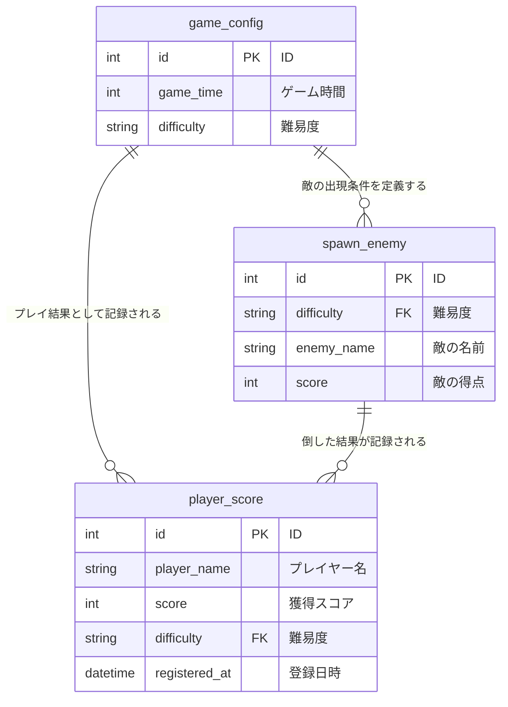

## はじめに
- 本リポジトリは、Java を用いた個人開発として  Seiya が作成した Minecraft プラグイン「EnemyDownApp」に関するものです。
- ご利用いただくことによるトラブル等につきましては、一切の責任を負いかねますことを予めご了承ください。

## アプリ概要
- REST APIを用いて、ゲーム時間や難易度などのデータ取得する機能のアプリです。
- データベースの登録・更新はPostmanを用いて、データベースに情報を追加します。

## データベース設計　　　　　　　　　　　　　　　　　　　　　　　　　　　　　　　　　　　　　　　　　　　　　　　　　　　　　　　　　　　　　　　　　　　　　　
| 属性 | 設定値 |
|-----|-----|
| データベース名 | enemy_down |
| テーブル名 | 以下の通り |

- game_config
- player_score
- spawn_enemy

## ER図

## アプリから情報を取得
https://github.com/user-attachments/assets/c34697a3-ef66-497f-8b93-88bcac84fe62

## アプリへの情報追加・更新
https://github.com/user-attachments/assets/b14f19b3-86cc-417f-a992-2c93cc75affd

## 主な使用技術・環境

| |技術・環境   |
|-----|-----|
| バックエンド |&nbsp; |
| データベース | | 
| 使用ツール |&nbsp;&nbsp;&nbsp;| 

## おわりに
* Java学習者のアウトプットして、リポジトリ公開させていただきました。
* 感想・コメント等あればXアカウント[@Seiya_engineer]( https://x.gd/daily_study)までご連絡くださると幸いです。
