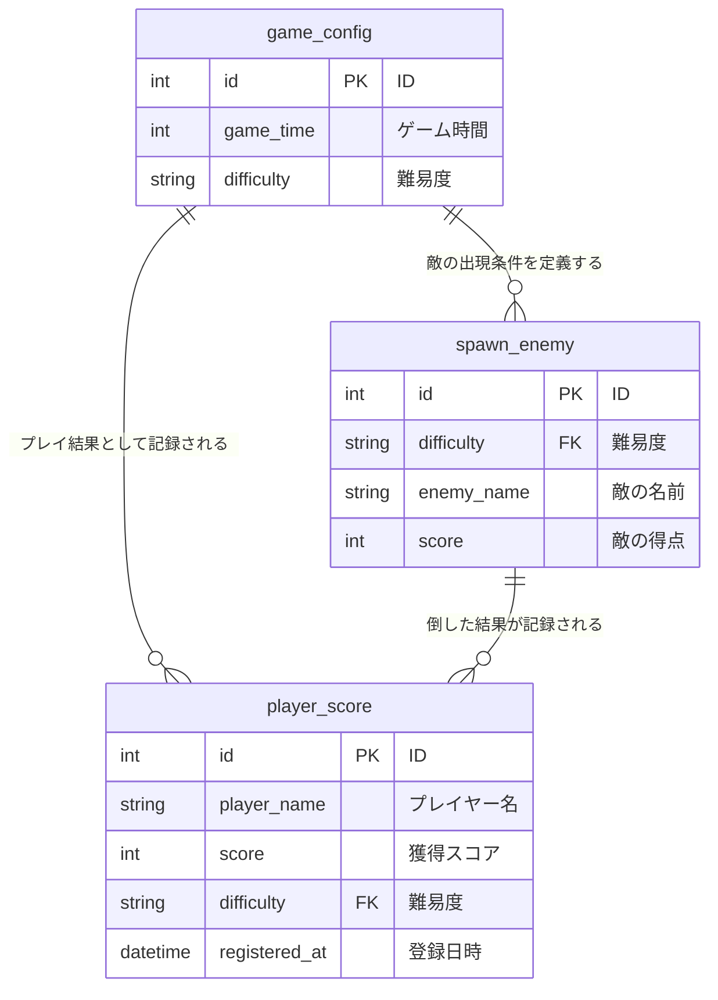

## はじめに
- 本リポジトリは、Java を用いた個人開発としてSeiyaが作成した「EnemyDownApp」に関するものです。
- ご利用いただくことによるトラブル等につきましては、一切の責任を負いかねますことを予めご了承ください。
  
## 主な使用技術・環境
| |技術・環境   |
|-----|-----|
| バックエンド |&nbsp; |
| データベース | | 
| 使用ツール |&nbsp;&nbsp;&nbsp;| 


## 制作背景
バックエンドの処理フローを構造的に理解できるようにすることを目的に、Spring Bootを用いてREST APIの設計から実装までを一貫して行いました。
フレームワークの標準構成を活かし、データの取得および更新処理を実装しています。

## データベース設計（ER図）　　　　　　　　　　　　　　　　　　　　　　　　　　　　　　　　　　　　　　　　　　　　　　　　　　　　　　　　　　　　　　　　　　　　　　


## アプリから情報を取得
https://github.com/user-attachments/assets/c34697a3-ef66-497f-8b93-88bcac84fe62

## アプリへの情報追加・更新
https://github.com/user-attachments/assets/b14f19b3-86cc-417f-a992-2c93cc75affd

## 例外処理
https://github.com/user-attachments/assets/1658e8f9-0503-4048-984f-5e52b00ae4dd

設定ファイルの内容が重複している場合に投げられる、独自に定義した例外クラスです。

```java
 //DuplicateConfigExceptionクラス
 
package plugin.enemydown.App;

public class DuplicateConfigException extends Exception {

  public DuplicateConfigException() {
    super();
  }

  public DuplicateConfigException(String message) {
    super(message);
  }

  public DuplicateConfigException(String message, Throwable cause) {
    super(message, cause);
  }

  public DuplicateConfigException(Throwable cause) {
    super(cause);
  }
}
```

難易度をキーに既存の設定を検索し、すでに登録済みの場合は`DuplicateConfigException` を投げて登録処理を中断します。<br>
未登録の場合のみ設定を登録し、登録後の設定情報を返します。

```java
//ConfigServiceクラス 
 
  public GameConfig registerConfig(GameConfig config) throws Exception {
    if (searchConfig(config.getDifficulty()) != null) {
      throw new DuplicateConfigException("Duplicate Config Error!");
    }
    mapper.insertConfig(config);
    return mapper.selectConfig(config.getDifficulty());
  }
```

`DuplicateConfigException` 発生時に呼び出される例外ハンドラを定義しています。<br>
エラー内容を JSON 形式で返すことで、クライアント側で原因を判別しやすくしています。

```java
 //ConfigControllerクラス
  
 @ExceptionHandler(value = DuplicateConfigException.class)
  public ResponseEntity<Map<String, String>> handleDuplicateConfig(
      DuplicateConfigException e, HttpServletRequest request) {
    Map<String, String> body = Map.of(
        "timestamp", ZonedDateTime.now().toString(),
        "status", String.valueOf(HttpStatus.INTERNAL_SERVER_ERROR.value()),
        "error", HttpStatus.INTERNAL_SERVER_ERROR.getReasonPhrase(),
        "message", e.getMessage(),
        "path", request.getRequestURI());
    return new ResponseEntity(body, HttpStatus.INTERNAL_SERVER_ERROR);
  }
```

## おわりに
* Java学習者のアウトプットして、リポジトリ公開させていただきました。
* 感想・コメント等あればXアカウント[@Seiya_engineer]( https://x.gd/daily_study)までご連絡くださると幸いです。
