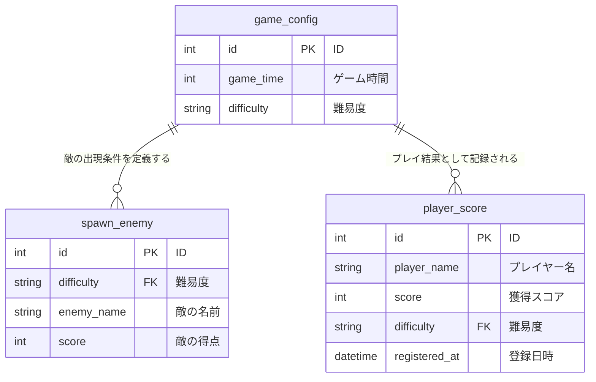

## はじめに
- 本リポジトリは、Java を用いた個人開発としてSeiyaが作成した「RestApiApp」に関するものです。
- ご利用いただくことによるトラブル等につきましては、一切の責任を負いかねますことを予めご了承ください。
  
## 主な使用技術・環境
| |技術・環境   |
|-----|-----|
| バックエンド |&nbsp; |
| データベース | | 
| 使用ツール |&nbsp;&nbsp;&nbsp;| 


## 制作背景
バックエンドの処理フローを構造的に理解することを目的に、Spring Bootを用いて、RESTAPIの設計から実装までを一貫して行いました。
Controllerでリクエストを受け取り、Serviceでデータの取得・登録・更新や、登録時の重複チェックを行い、Mapperでデータベースにアクセスする構造を採用しています。
これらにより、データの取得や追加・更新処理をフローに沿って整理し、標準的なMVCモデルに則った実装をしています。

## データベース設計（ER図）　　　　　　　　　　　　　　　　　　　　　　　　　　　　　　　　　　　　　　　　　　　　　　　　　　　　　　　　　　　　　　　　　　　　　　


## アプリから情報を取得
https://github.com/user-attachments/assets/c34697a3-ef66-497f-8b93-88bcac84fe62

ゲーム設定に関するリクエストを受け付ける Controller 層のクラスです。<br>各エンドポイントで Service クラスを呼び出し、Service 層を介して取得したデータをクライアントに返却します。
```java
@RestController
public class ConfigController {

  @Autowired
  private ConfigService service;

  @GetMapping(value = "/configList")
  public List<GameConfig> searchConfigList() {
    return service.searchConfigList();
  }

  @GetMapping(value = "/config")
  public GameConfig searchConfig(@RequestParam String difficulty) {
    return service.searchConfig(difficulty);
  }

  @GetMapping(value = "/spawnEnemyList")
  public List<SpawnEnemy> spawnEnemyList(@RequestParam String difficulty) {
    return service.searchSpawnEnemyList(difficulty);
  }
```

ゲーム設定に関するデータを取得するためのService層のクラスです。<br>Controller からの要求を受け取り、Mapper を介してデータベースから設定情報を取得します。
```java
@Service
public class ConfigService {

  @Autowired
  private GameConfigMapper mapper;

  public List<GameConfig> searchConfigList() {
    return mapper.selectConfigList();
  }

  public GameConfig searchConfig(String difficulty) {
    return mapper.selectConfig(difficulty);
  }

  public List<SpawnEnemy> searchSpawnEnemyList(String difficulty) {
    return mapper.selectSpawnEnemyList(difficulty);
  }
```

MyBatis を利用した Mapper クラスであり、game_config および spawn_enemy テーブルに対する SQL を定義しています。<br>
データベースから取得した結果を各エンティティにマッピングし、Service 層に返却します。
```java
@Mapper
public interface GameConfigMapper {

  @Select("select * from game_config order by id asc")
  List<GameConfig> selectConfigList();

  @Select("select * from game_config where difficulty = #{difficulty} order by id asc")
  GameConfig selectConfig(String difficulty);

   @Select("select * from spawn_enemy inner join game_config on spawn_enemy.difficulty = game_config.difficulty where spawn_enemy.difficulty = #{difficulty} order by spawn_enemy.id asc")
  List<SpawnEnemy> selectSpawnEnemyList(String difficulty);
```


## アプリへの情報追加・更新
https://github.com/user-attachments/assets/b14f19b3-86cc-417f-a992-2c93cc75affd

各エンドポイントで Service クラスを呼び出し、Service 層を介して追加および更新処理の結果をクライアントに返却します。
```java
@RestController
public class ConfigController {

  @Autowired
  private ConfigService service;
  
  @PostMapping(value = "/config")
  public ResponseEntity<GameConfig> registerConfig(@RequestBody GameConfig config)
      throws Exception {
    GameConfig registerConfig = service.registerConfig(config);
    return new ResponseEntity<>(registerConfig, HttpStatus.OK);
  }

  @PostMapping(value = "/updateEnemyScore")
  public ResponseEntity<List<SpawnEnemy>> updateEnemyScore(@RequestBody SpawnEnemy enemy) {
    List<SpawnEnemy> updatedSpawnEnemyList = service.updateEnemyScore(enemy);
    return new ResponseEntity<>(updatedSpawnEnemyList, HttpStatus.OK);
  }
}
```

Controller からの要求を受け取り、Mapper を介してデータベースにアクセスします。
```java
@Service
public class ConfigService {

  @Autowired
  private GameConfigMapper mapper;
  
    public GameConfig registerConfig(GameConfig config) throws Exception {
    if (searchConfig(config.getDifficulty()) != null) {
      throw new DuplicateConfigException("Duplicate Config Error!");
    }
    mapper.insertConfig(config);
    return mapper.selectConfig(config.getDifficulty());
  }

  public List<SpawnEnemy> updateEnemyScore(SpawnEnemy enemy) {
    mapper.updateEnemyScore(enemy);
    return mapper.selectSpawnEnemyList(enemy.getDifficulty());
  }
}
```

game_config および spawn_enemy テーブルに対する追加・更新処理の SQL を定義しています。<br>
Mapper は Service 層から呼び出され、データベースの状態を変更します。
```java
@Mapper
public interface GameConfigMapper {

  @Insert("insert game_config(game_time, difficulty) values(#{gameTime}, #{difficulty})")
  int insertConfig(GameConfig config);

  @Update("update spawn_enemy set score = #{score} where enemy_name = #{enemyName} and difficulty = #{difficulty}")
  int updateEnemyScore(SpawnEnemy enemy);
  
}
```


## 例外処理
https://github.com/user-attachments/assets/1658e8f9-0503-4048-984f-5e52b00ae4dd

設定ファイルの内容が重複している場合に投げられる、独自に定義した例外クラスです。

```java
public class DuplicateConfigException extends Exception {

  public DuplicateConfigException() {
    super();
  }

  public DuplicateConfigException(String message) {
    super(message);
  }

  public DuplicateConfigException(String message, Throwable cause) {
    super(message, cause);
  }

  public DuplicateConfigException(Throwable cause) {
    super(cause);
  }
}
```

難易度をキーに既存の設定を検索し、すでに登録済みの場合は`DuplicateConfigException` を投げて登録処理を中断します。<br>
未登録の場合のみ設定を登録し、登録後の設定情報を返します。

```java
  public GameConfig registerConfig(GameConfig config) throws Exception {
    if (searchConfig(config.getDifficulty()) != null) {
      throw new DuplicateConfigException("Duplicate Config Error!");
    }
    mapper.insertConfig(config);
    return mapper.selectConfig(config.getDifficulty());
  }
```

`DuplicateConfigException` 発生時に呼び出される例外ハンドラを定義しています。<br>
エラー内容を JSON 形式で返すことで、クライアント側で原因を判別しやすくしています。

```java
 @ExceptionHandler(value = DuplicateConfigException.class)
  public ResponseEntity<Map<String, String>> handleDuplicateConfig(
      DuplicateConfigException e, HttpServletRequest request) {
    Map<String, String> body = Map.of(
        "timestamp", ZonedDateTime.now().toString(),
        "status", String.valueOf(HttpStatus.INTERNAL_SERVER_ERROR.value()),
        "error", HttpStatus.INTERNAL_SERVER_ERROR.getReasonPhrase(),
        "message", e.getMessage(),
        "path", request.getRequestURI());
    return new ResponseEntity(body, HttpStatus.INTERNAL_SERVER_ERROR);
  }
```

## 今後の展望
- 今後は JUnit を用いた単体テストにも取り組みたいと考えています。

- OpenAPI（Swagger）を導入し、エンドポイントやリクエスト／レスポンス形式を可視化することで、API 利用者にとって分かりやすい設計を意識した開発を行います。

- 現在はバックエンドの設計理解を優先するためローカル環境での実行に留めていますが、今後は AWS（EC2 + RDS など）を用いたデプロイにも取り組み、インフラを含めたアプリケーション構成への理解を深めていきたいと考えています。

## おわりに
* 感想・コメント等あればXアカウント[@Seiya_engineer]( https://x.gd/daily_study)までご連絡くださると幸いです。
